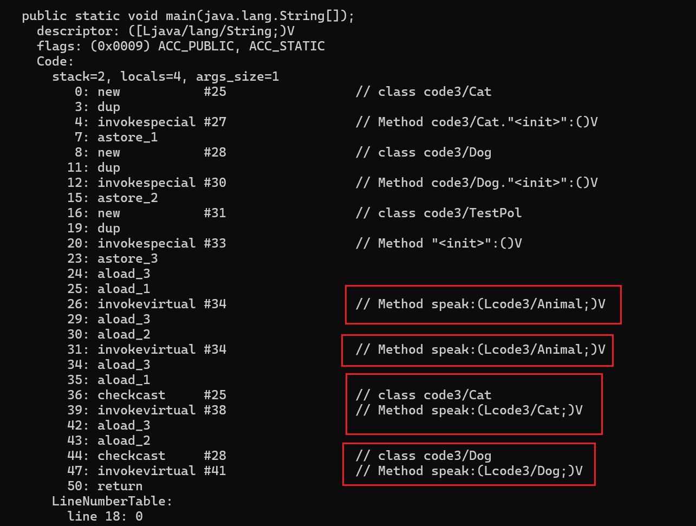
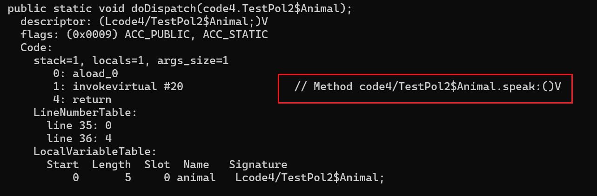

# 多态

## 什么是多态

一个对象可以呈现不同的状态

`extend`继承 或者 `implements`实现，（产生一个上下关系）是实现多态的前提


>  表示从不同的视角看待这个对象（接口也是类似）

- 简单理解一下吧

比如有如下代码

```java
Animal a=new Cat();
```

就表示创建一个Cat的对象，但是我们要以Animal的视角去看待这个对象，因此我们只能去调用Animal里面存在的方法和变量。


- 简单理解一下这句：

```
接口名称 对象名 = new 接口的实现类	
```

假设有一个swim接口，Cat和Dog类实现了这个swim接口，那么接口多态就可以写成swim swimmingcat = new Cat()

可以简单理解为把Cat的对象用会游泳的东西去看待


## 调用格式

> 父类引用指向子类对象

```
父类 对象名 = new 子类();
	
	或者
	
接口名称 对象名 = new 接口的实现类	
```


## 转型

### 向上转型

```java
Animal a=new Cat();
```

即本来是猫，从动物这个更大的视角去看待了

### 向下转型

```java
Animal a=new Cat();
Cat c=(Cat) a;
```

即先把猫这个对象当作动物去看待，然后再用看猫的视角去看待这个Cat对象

- 以猫的视角去看Cat的对象才可以调用Cat的特有方法

```java
c.catchMouse();
```

但是，如果这样向下转型就会报错

```java
Animal a=new Cat();
Dog d=(Dog) a;
d.lookhome();
```

因为本来在堆中new出来的对象是Cat的对象，实际类型是Cat，不能以狗的视角去看待猫

#### 如何进行安全的向下转型

> 使用`instanceof `，返回值是true，false

可以判断引用的实际对象是否是一个类型的实例


## 举例


## 关于成员方法原理

### 为什么编译看左边，运行看右边

> 学习详见大佬[Java多态原理 - JVM的静态分派和动态分派](https://wiyi.org/java-polymorphism-in-deep.html)

使用了多态调用成员方法，我们就需要知道应该去调用谁的成员方法，这是一个方法分派的过程。

方法分派过程按照类型划分，又有`静态分派`和`动态分派`两种

---

#### 为什么编译看左边？

静态分派是指**选择方法的过程发生在编译期**

因为在编译时使用的是静态分派

> 代码1

- 如下例子：（没有摘入继承的代码）

```java
public class TestPol {
    public static class Animal{

    }
    public static class Cat extends Animal{

    }
    public static class Dog extends Animal{

    }

    public void speak(Animal animal) {
        System.out.println("undefined...");
    }

    public void speak(Cat cat) {
        System.out.println("miao...");
    }

    public void speak(Dog dog) {
        System.out.println("wang...");
    }

    public static void main(String[] args) {
        Animal cat = new Cat();
        Animal dog = new Dog();
        TestPol speaker = new TestPol();
        speaker.speak(cat);
        speaker.speak(dog);
        speaker.speak((Cat)cat);
        speaker.speak((Dog)dog);
    }
}

```

- 运行结果

```
# undefined...
# undefined...
# miao...
# wang...
```


首先为标准的多态写法，因此是正确的

```java
Animal cat = new Cat();
Animal dog = new Dog();
```


在  **Java**  编译的过程中是不会执行new关键字去创建对象的。

在编译期间，编译器只能根据变量**`声明时的类型`**来确定选择调用哪个方法的实现。这种类型称为变量的**静态类型**。

我们可以使用   javap -v ‘路径’   的命令查看字节码文件



具体我现在也不知道什么意思，但是可以看出来编译器在编译时就选择好了应该执行谁下面的speak方法

并且可以发现与我们定义时是一一对应的

```java
Animal cat = new Cat();
Animal dog = new Dog();
speaker.speak((Cat)cat);
speaker.speak((Dog)dog);

//声明类型分别为：
//# Animal
//# Animal
//# Cat
//# Dog
```

> 我们发现，多态调用哪一个类中的方法时在编译期间就已经决定了！！！
>
> 于是就有了编译看左边这句话
>
> 编译时，如果左边类中找不到对应方法，编译器就会在静态分派时报错


#### 为什么运行看右边

> 代码2

- 先举一个代码例子

```java
package code4;

public class TestPol2 {
    public static class Animal {
        public void speak() {
            System.out.println("undefined");
        }

        public void run() {

        }
    }

    public static class Dog extends Animal {
        @Override
        public void speak() {
            System.out.println("wang..");
        }
    }

    public static class Cat extends Animal {
        @Override
        public void speak() {
            System.out.println("miao..");
        }
    }

    public static void main(String[] args) {
        TestPol2 dispatcher = new TestPol2();
        dispatcher.doDispatch(new Cat());
        dispatcher.doDispatch(new Dog());
    }

    public static void doDispatch(Animal animal) {
        animal.speak();
    }

}

```

- 运行结果

```
#miao..
#wang..
```


此时如果按照静态分派的话，调用的方法位置应该由Animal animal的Animal决定

```java
public void doDispatch(Animal animal) {
    animal.speak();
}
```

我们同样也去看看字节码文件



可以看到在`doDispatch`调用`speak`方法时，编译期间同样也是静态分派，选择了`Animal`的`speak`方法，这里也再次印证了编译看左边

> 请注意代码1和代码2调用方法时不一样，代码2调用的是`类的方法`，代码1使用的是`方法的重载`


因为代码2的例子，对方法进行调用时，显然是根据引用的**`实际类型`**选择方法，我们把这种分派逻辑称为动态分派。

简单来说：当一个**`对象的方法`**被调用时，`Java`会在运行时查找该对象的实际类型，并选择与该实际类型匹配的方法版本。


但是为什么最后运行的时候时看右边呢？

虽然字节码文件中是Animal的speak方法，但是在运行时这分派逻辑由`invokevirtual`指令定义

**Java虚拟机**中**规定**了`invokevirtual`指令的逻辑

> 假设`C`是引用`objectref`所属的类，实际要调用的方法遵循以下的查找过程:
>
> 1. 如果`C`中存在一个方法`m`,它重写(Override)了被解析的方法，那么直接调用此方法，结束查找过程。
> 2. 如果第一步中找不到此方法，且`C`存在父类(superclass)，那么对它的父类重复第一步的查找过程。
> 3. 如果都找不到，则抛出`AbstractMethodError`。

关于这个`C`和`objectref`举个例子：

```java
Animal cat = new Cat();
Animal dog = new Dog();
```

> 在上面的例子中:
>
> `objectref`是`cat`和`dog`这两个变量。这些变量是对`Animal`类的实例的引用。
>
> 1. 对于`cat`变量,  它指向的对象是`Cat`类的实例,  因此它所属的类`C`是`Cat`。
> 2. 对于`dog`变量,  它指向的对象是`Dog`类的实例,  因此它所属的类`C`是`Dog`。
>
> 在这个例子中,  根据 `cat`和 `dog` 的实际对象类型,  `C`分别是 `Cat` 和 `Dog`。


于是我们就发现，运行时会去看右边是否有该方法，有就调用，没有就使用父类的

### 总结

> 当调用的方法为类的方法时，Java会在编译时使用静态分派，根据声明的类先决定使用谁的方法，如果该类中没有该方法则报错，即（编译看左边）
>
> 当运行时，会根据Java虚拟机的规则，去看右侧类中对应的方法，即（运行看右边）

当然，如果是直接使用方法的重载，那么Java只会去使用静态分派


然而，静态方法，私有方法等等在编译期间就可以确定下来，就不会参与动态分派过程：

如：

```java
class A {
    static void staticMethod() {
        System.out.println("Static method in A");
    }
}

class B extends A {
    static void staticMethod() {
        System.out.println("Static method in B");
    }
}

public class Main {
    public static void main(String[] args) {
        A obj = new B();
        obj.staticMethod(); // 调用的是A类中的staticMethod
    }
}

```


## 关于成员变量

> 成员变量不涉及动态分派，在编译期间就会被确定下来
>
> 于是对于成员变量是编译看左边，运行也看左边


